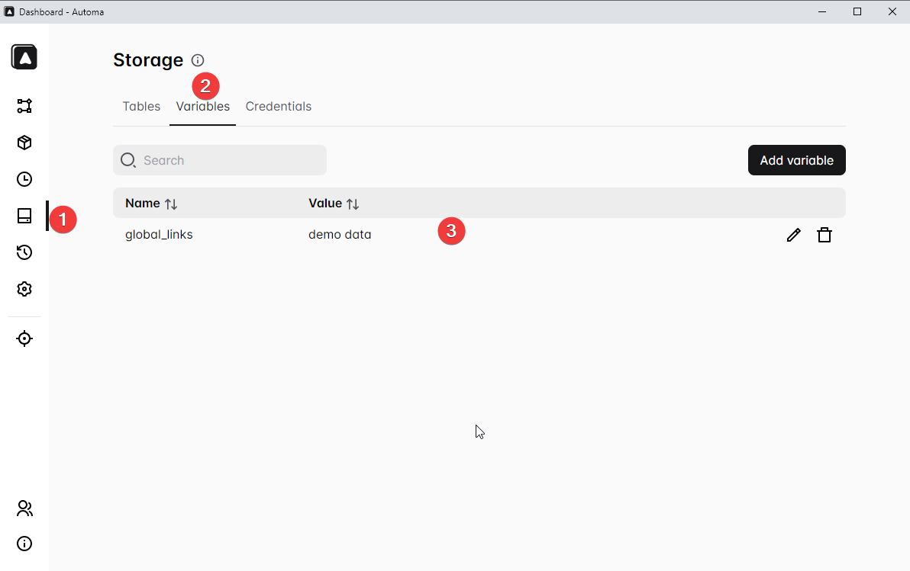

## Read/write storage variables

**Define storage variables**



```js
// Read the storage variables with javascript block
var value = automaRefData('variables', '$$global_links');

// Write the storage variables with javascript block
automaSetVariable('$$global_links', "UPDATED VARIABLES");

console.log(automaRefData('variables', '$$global_links'));
```

## Access workflow variable from setting

https://docs.automa.site/workflow/expressions.html

```
{{ variables.var_name }}
```

Get workflow variable in Javascript block

```js
const value = automaRefData('variables', 'current_url');

console.log("current_url", value);

automaNextBlock()
```

